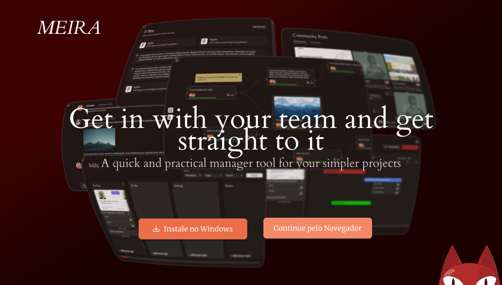

# *MEIRA*

Meira é um sistema de gerenciamento de projetos projetado para ser simples, rápido e intuitivo, com uma interface visual baseada em nós que permite uma organização flexível e criativa do fluxo de trabalho.

URL do Site - meira.marce1in.com.br




## Documentação

-   [Design no Figma](https://www.figma.com/design/3WPWZ4vg8Jhko8WShunbC2/Meira?node-id=0-1&p=f)
-   [Documentação](https://docs.google.com/document/d/1QwLDafesZ4E4QJrc8esA5vFtrIBKsohrbqQaeQj0nNE/edit?pli=1&tab=t.hds3hy8uora1#heading=h.rxz6u46fo0of)
-   [Diagrama Casos de uso]('https://gitlab.com/senac-projetos-de-desenvolvimento/2025-marcelo-oscaberry-dos-santos/meira/-/blob/main/public/DiagramaCasosUso.png')
-   [DiagramaER](https://gitlab.com/senac-projetos-de-desenvolvimento/2025-marcelo-oscaberry-dos-santos/meira/-/blob/main/public/DiagramaER.jpg)

## Features

### Funcionalidades Principais

-   **Home e Landing Page:** Uma página inicial para listar projetos e uma landing page que serve como ponto de entrada para a aplicação.
-   **Colaboração em Tempo Real:** Alterações no Traceboard, Kanban e outros módulos são sincronizadas instantaneamente para todos os membros do projeto, utilizando Laravel Reverb.
-   **Sistema de Notificações:** Alertas sobre atribuições de tarefas, início de sprints, convites para projetos e mais.
-   **Perfis de Usuário e Comunidade:** Uma seção de perfil para exibir projetos publicados e uma área de comunidade para ver a atividade de amigos e outros usuários.

### Ferramentas de Gerenciamento de Projeto

-   **Traceboard:** Um canvas visual e infinito para construir "árvores de tarefas", permitindo uma visualização flexível e em tempo real do progresso do projeto.
-   **Kanban Board:** Um quadro Kanban tradicional para gerenciamento de tarefas baseado em colunas.
-   **Pinboard:** Uma área para fixar links, anotações e outras informações importantes, mantendo tudo centralizado.
-   **Chat de Equipe:** Um chat integrado para comunicação direta e rápida entre os membros do projeto.
-   **Sprint Planner:** Uma ferramenta dedicada para planejar, iniciar e acompanhar sprints de desenvolvimento.

## Stack Tecnológica

### Backend
-   **Framework**: [Laravel 12](https://laravel.com/)
-   **Tempo real / WebSockets**: [Laravel Reverb](https://reverb.laravel.com/)
-   **Autenticação**: [WorkOS](https://workos.com/)
-   **Runtime**: [Laravel Octane](https://laravel.com/docs/octane) com [FrankenPHP](https://frankenphp.dev/)

### Frontend
-   **Framework**: [Inertia.js](https://inertiajs.com/) com [React](https://react.dev/)
-   **Estilização**: [Tailwind CSS](https://tailwindcss.com/)
-   **Componentes**: [shadcn/ui](https://ui.shadcn.com/)
-   **Interface de Nós**: [@xyflow/react](https://reactflow.dev/)

### Infraestrutura
-   **Banco de dados**: [Neon PostgreSQL](https://neon.tech/)
-   **Deploy**: [Fly.io](https://fly.io/)

## Getting Started

Siga as instruções abaixo para configurar o ambiente de desenvolvimento local.

### Pré-requisitos

-   PHP 8.4+
-   Composer
-   Node.js 24+
-   NPM
-   Um banco de dados de sua preferência (o padrão no `.env.example` é SQLite).

### 1. Instalação

```bash
# Clone o repositório
git clone https://gitlab.com/senac-projetos-de-desenvolvimento/2025-marcelo-oscaberry-dos-santos/meira
cd meira

# Instale as dependências do PHP e Node.js
composer install
npm install

# Crie o arquivo de ambiente e gere a chave da aplicação
cp .env.example .env
php artisan key:generate
```

### 2. Configuração do Ambiente (.env)

Abra o arquivo `.env` e configure as seguintes variáveis:

-   **Banco de Dados:** Configure as variáveis `DB_*` de acordo com o banco de dados que você escolheu. Para usar SQLite, basta criar o arquivo:
    ```bash
    touch database/database.sqlite
    ```

-   **Autenticação (WorkOS):** Preencha as credenciais do WorkOS. Você pode obtê-las no dashboard do [WorkOS](https://workos.com/).
    ```env
    WORKOS_CLIENT_ID=...
    WORKOS_API_KEY=...
    WORKOS_REDIRECT_URL="http://localhost:8000/authenticate"
    ```

-   **WebSockets (Reverb):** Para o ambiente local, altere `BROADCAST_CONNECTION` e defina as variáveis do Reverb. As chaves podem ser geradas aleatoriamente.
    ```env
    BROADCAST_CONNECTION=reverb

    REVERB_APP_ID=meira-app-id
    REVERB_APP_KEY=meira-app-key
    REVERB_APP_SECRET=meira-app-secret
    REVERB_HOST="localhost"
    REVERB_PORT=8080
    REVERB_SCHEME=http
    ```

-   **Vite:** Certifique-se de que as variáveis do Vite para o Reverb estão corretas para o frontend.
    ```env
    VITE_REVERB_APP_KEY="${REVERB_APP_KEY}"
    VITE_REVERB_HOST="${REVERB_HOST}"
    VITE_REVERB_PORT="${REVERB_PORT}"
    VITE_REVERB_SCHEME="${REVERB_SCHEME}"
    ```

### 3. Finalização

Execute as migrações do banco de dados para criar as tabelas necessárias.

```bash
php artisan migrate
```

## Ambiente de Desenvolvimento

Para iniciar o ambiente de desenvolvimento completo (servidor web, Reverb, Vite e filas), execute o script `dev:all`:

```bash
composer run dev:all
```

Isso irá iniciar todos os serviços necessários de forma concorrente. A aplicação estará disponível em `http://localhost:8000`.

Alternativamente, você pode rodar cada serviço em um terminal separado:

```bash
# Terminal 1: Servidor Reverb
php artisan reverb:start

# Terminal 2: Servidor PHP
php artisan serve

# Terminal 3: Vite
npm run dev

# Terminal 4: Filas
php artisan queue:listen --tries=1
```

## Motivação e Justificativa

Identificamos no mercado a falta de aplicativos de gerenciamento de projetos que atendessem as necessidades de times gerenciando projetos menores ou times simplesmente desinteressados em usar uma grande gama de ferramentas complexas. Esse tipo de time é muito comum no ambiente acadêmico, sendo a área do Desenvolvimento de Software um exemplo perfeito.

Juntamos essa ideia com algumas outras percepções:

-   **Que todo tipo de ferramenta merece versões simplificadas** - Uma pessoa que precisa fazer um corte simples numa imagem não ganha nada escolhendo o Photoshop ao invés de qualquer editor de imagem simples de navegador. Pelo contrário: para leigos de edição de imagem, toda a complexidade adicionada ao escolher o Photoshop contribuiria ativamente para uma experiẽncia negativa.
-   **Que outras ferramentas semelhantes haviam, fora a falta de praticidade, outros defeitos**, como UIs confusas, falta de instruções, e, principalmente, desempenhos terríveis.

<div align="center">

</div>
